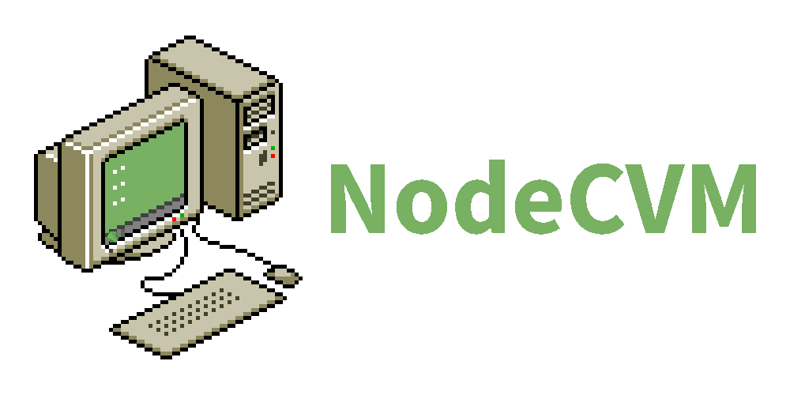

# NodeCVM

NodeCVM is a CollabVM server written in Node.js. It is pretty easy to use and is cross-platform (it should work on everything that node supports).
## How to get started
First install Node.js by downloading it from its website (if you're on Windows) or by using a package manager (if you are on Linux or other). In the package manager its either going to be called <code>node</code> or something similar.

Then install Git, also by downloading it from here: https://git-scm.com/download/win (Windows) or by using a package manager (Linux, etc).

After Git is installed, type <code>git clone https://github.com/cabfile/NodeCVM.git nodecvm</code>.

Go to the newly created folder with the name **nodecvm**, and If you're on Windows, just run <code>installdeps.bat</code>. If you don't wanna run that or if you are using Linux or any other operating system, type:
<pre>
npm i ws jimp vnc-rfb-client image-size
</pre>
Now just wait for npm to install the needed packages. After all of that is done, simply type <code>node server.js</code> and the server will start in chat-only mode.
### "Chat-only mode"? What's that?
The chat-only mode is a "mode" similar to the (now gone) "So much win!" UserVM. As you may have guessed, it does not show anything useful on the VM screen.

To change that, open the server.js file in a text editor (any will work, even the normal Notepad on Windows). You should see this very big variable:
<pre>
var vm = {
	// You may wanna change stuff on here.
	nodename: "nodecvm", // This is the name of the node, which is used for connection to the VM (not the server itself)
	settings: {
		oneUserPerIP: true, // Setting this to false may result in unwanted behavior, so you might wanna keep it at true.
		escapeHTML: true, // Escape symbols that can be used for HTML tags? If you set it to false, get ready for people to send HTML tags (XSS) in chat!
		hideButtons: true, // When set to true, the server will append some HTML tags to the Message Of The Day, so it will hide the Take Turn, Keyboard, Change Username and Vote for Reset buttons.
		vnc: {
			useVNC: false, // When set to true, will send data from a VNC server instead of using a static image (when set to false).
			// Everything below will only be used when useVNC is set to true.
			serverAddress: "127.0.0.1", // VNC server address to connect to.
			serverPort: 5900, // VNC server port to connect to.
			vncFps: 10, // How fast should we get a frame and send it to clients, in frames per second. (do not set it to a high value unless you know what you're doing!)
			autoRun: '', // When not empty, null or undefined, it will automatically run this command every time the server is launched. This is really useful for automatically launching QEMU.
			autoRunWait: 1000 // An amount of milliseconds to wait before connecting.
		}
	},
	// VM list info
	displayname: "NodeCVM " + version, // The displayed name of the VM, as seen in the VM list. You can replace its current value to something else. Also, you can use HTML tags. Better not use XSS, though.
	preview: base64("nodecvmlogosmall.png"), // What image to show in the VM list, seen when useVNC is set to false or when useVNC is set to true and we still haven't connected to the vnc server
	// Other settings
	display: "nodisplay.png", // What (file name of an) image to show when you're connected to the VM, leave empty if you dont want to use this. (shows only when useVNC is set to false)
	motd: 'Welcome to the NodeCVM VM! NodeCVM currently does not support turns and voting for reset, so sorry about that!', // The Message Of The Day ("description"), leave empty if you dont want to use this.
	// VM data, do not touch if you dont know what you're doing!
	chathistory: [], // The chat history, limited to 100 messages (as others wont be seen by the client).
	peopleonline: [], // Who is online.
	turnqueue: [] // The turn queue. Currently unused.
}
</pre>
What we actually need from there is the ***useVNC*** variable (key). Set it to **true**, and set ***serverAddress*** and ***serverPort*** to the address and port of a VNC server, to which you want the server to connect.
### What if I want to use...
Use what?
#### QEMU?
Well, then the next interesting thing to us will be ***autoRun*** and ***autoRunWait***. If ***autoRun*** is not empty, null, or undefined, the server will automatically run that command on startup.

The time *before* the server actually runs that command is controlled by ***autoRunWait***. Remember: 1000ms = 1s. Most of the time QEMU will only need 500ms (0.5s) to start and run its VNC server.

Oh fuck, almost forgot! To run QEMU with a VNC server, you have to append this to the command line: <code>-vnc :0</code>. You can change the 0 to whatever you want. If you don't know to what port does it start listening to, calculate it with the following formula: *5900 + x* where *x* is the number you entered.
#### VMware Workstation/Player?
I have no idea how to do it, but I know that there is a way to turn on a VNC server.
#### VirtualBox?
Sorry, but VirtualBox natively supports only RDP (but don't worry, soon I'll add support for RDP). However, if you are brave enough, you can recompile VirtualBox from source to have VNC support.
#### Bochs?
It does not have VNC support natively. Just like VirtualBox, you have to recompile it from source. But be aware: as far as I know, it has terrible VNC support.
#### Limbo?
Limbo is literally just QEMU. Some things are different, though.
#### 86box/PCem?
Apparently it *has* VNC support? But I think you have to recompile it from source.
#### Virtual x86?
You can't. It does not even have *any* VNC support.
